# WhiteOut-Survival-Heal-BOT

**+You cannot play and can use it at same time so i would Recommend to Use Farm accounts as Healing BOT during Battles**


**1. Open Any Web Browser**


**2. Search**  ``` BlueStacks 5 Download```


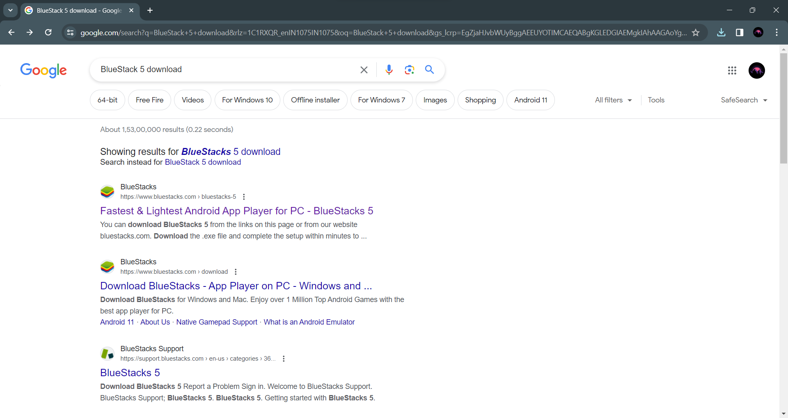

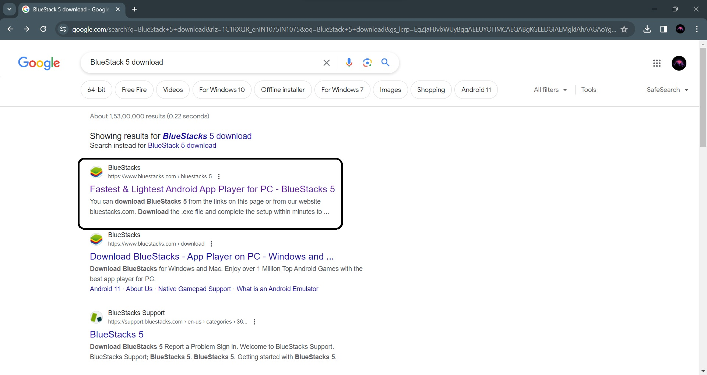

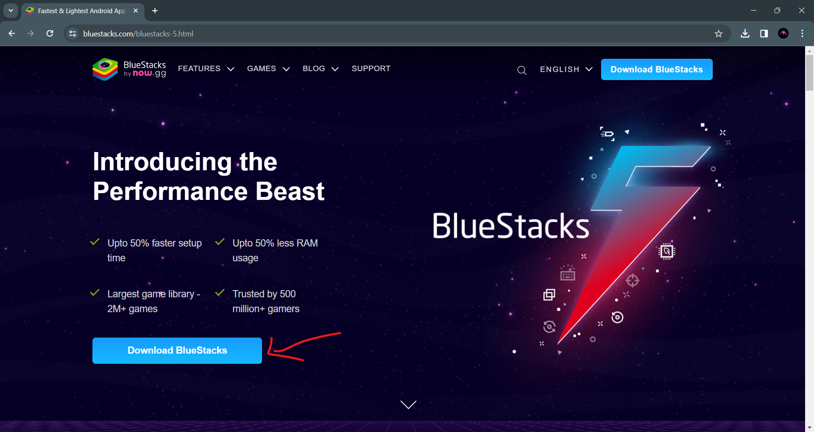


**3. Now go to Downloads folder of Device or access through Browser Downloads Option**

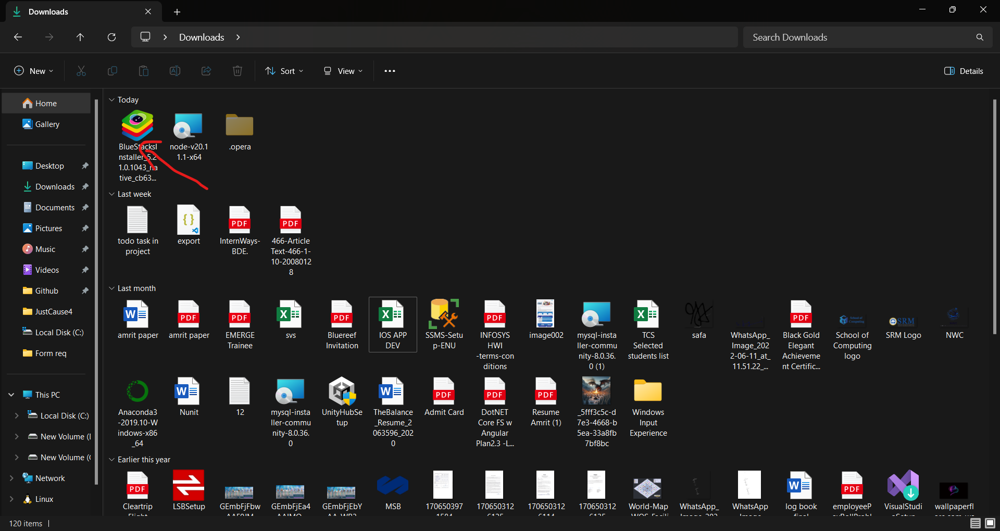

**4. Double Click on that and click on "YES"**


**5. Something like following will appear**


**6. Click On "Install"**

**7. click on I Agree**

**8. Now Wait for Downlaod to complete**

**9. After Download Something like following will Appear**

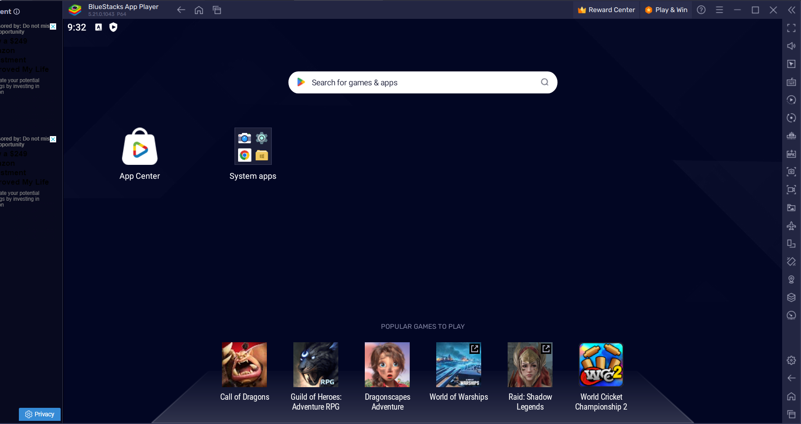

**10. Search** ```Whiteout Survival```

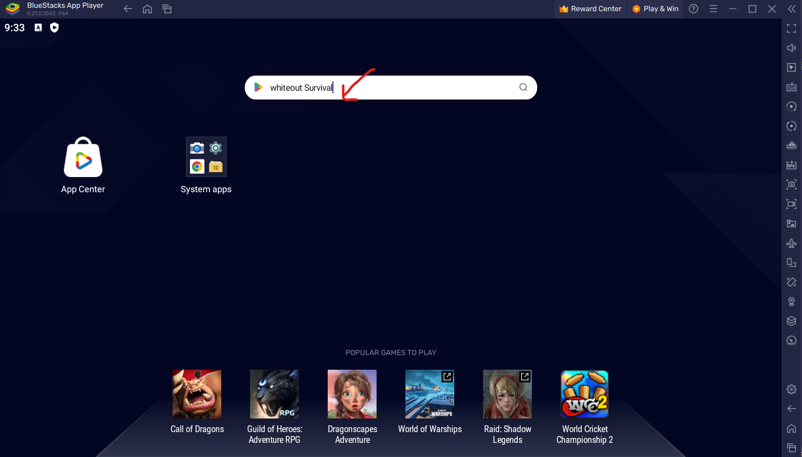

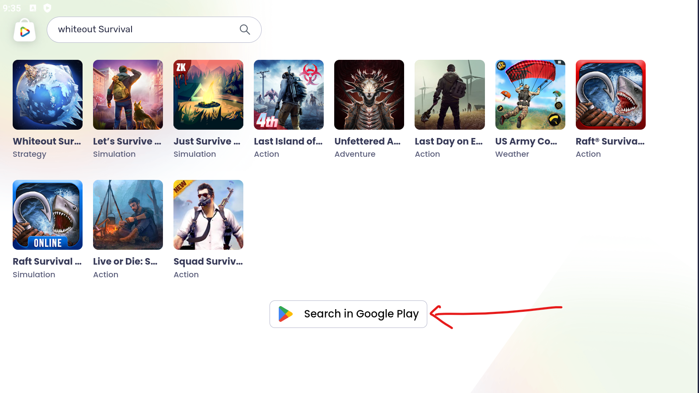

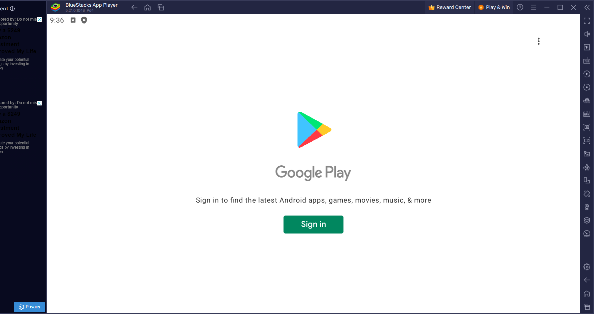

**11. Now Sign in using Your Game account**

**12. After that something like following will Appear**

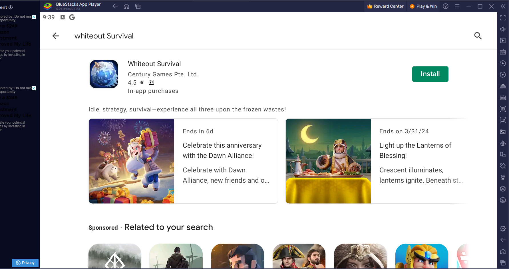

**13. Install the game**

**14. Open the game either click on Play or Game Logo on Your Desktop screen**

**Congrats you have Completed main task as of Now. now few Formality**

**Something like following will appear**


**15. Now  [Click here](https://github.com/amritanand-py/WhiteOut-Survival-Heal-BOT/blob/main/TAP%20TAP%20TAP.json)**

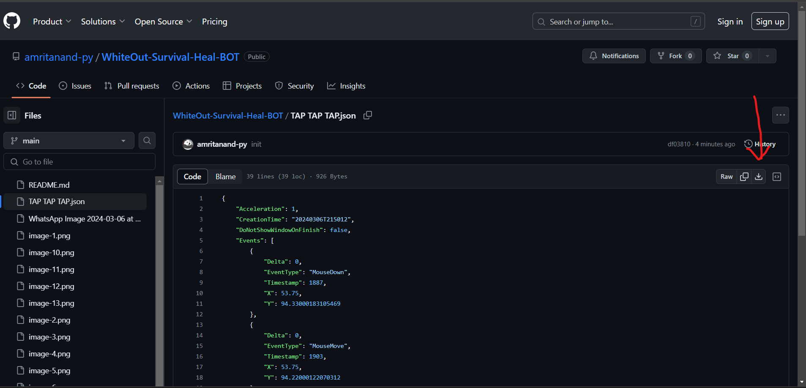

**16. Now click and Download the file  and comeback to Game**

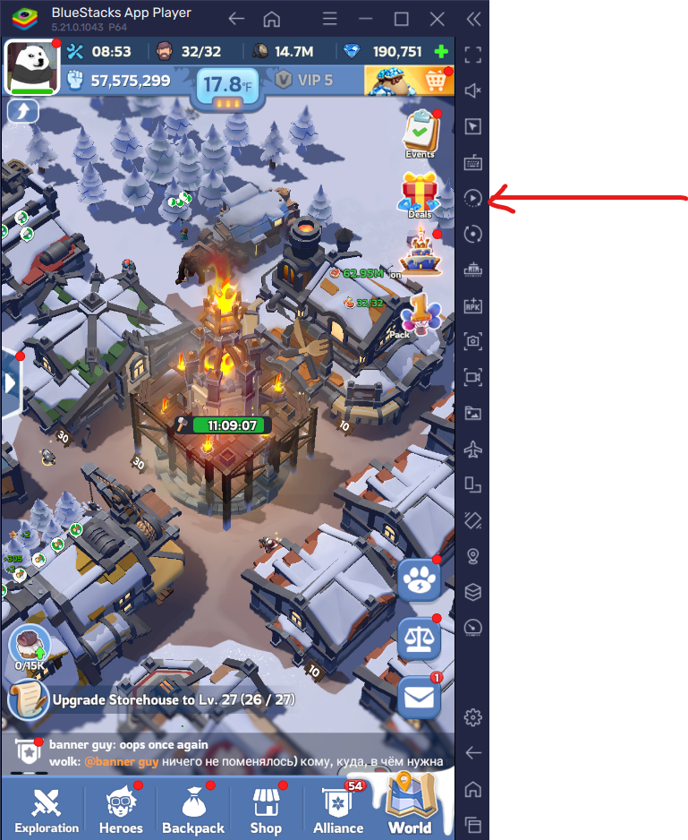

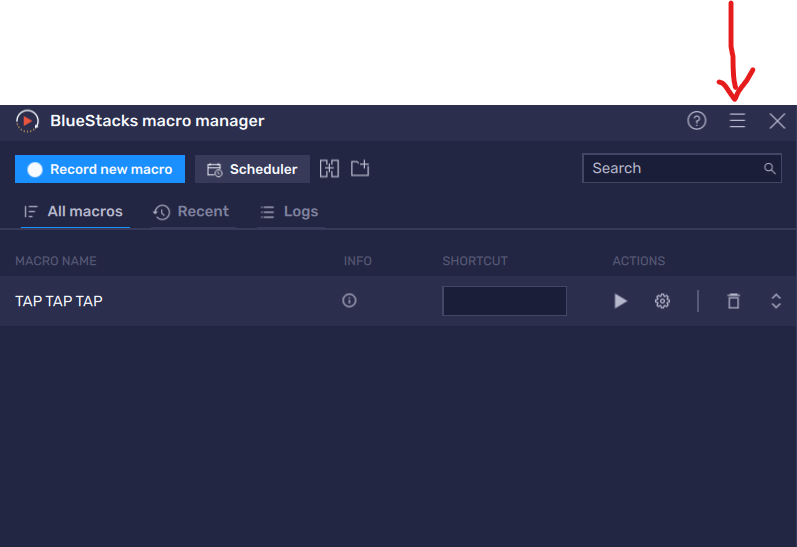

**17 Select "Import Macro"**

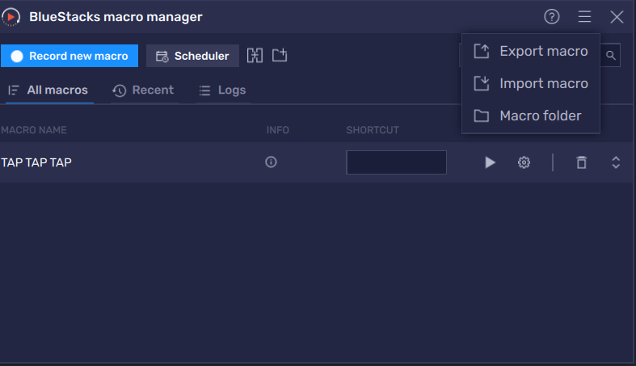

**18. Select Downloaded file and Import file**

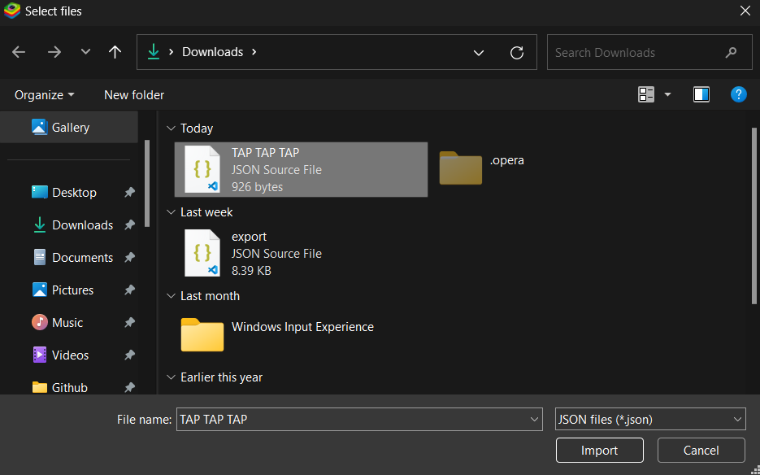

**19. Now it will appear something like this**

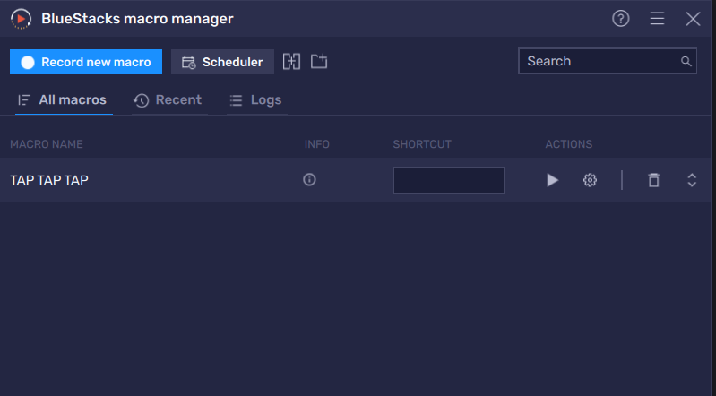

**20. Open Game Help Menu**
>Alliance-Help


**21. Now Start Macro**

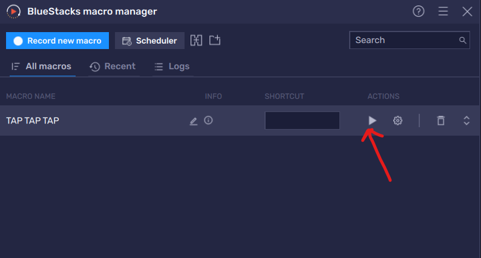

# Thanks for being patience you have unlocked Healing BOT for Your alliance 


**+ Feel free to reach out to me [STR]Banner Guy for Query or issue**